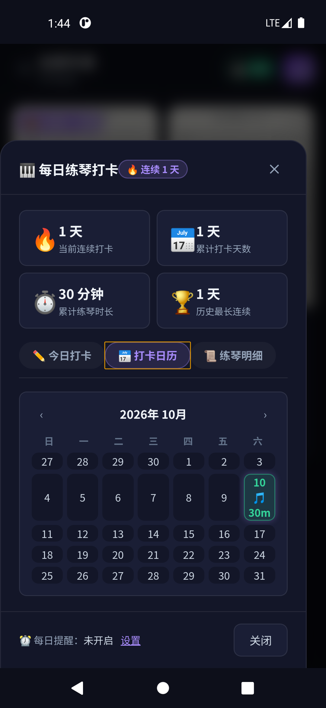
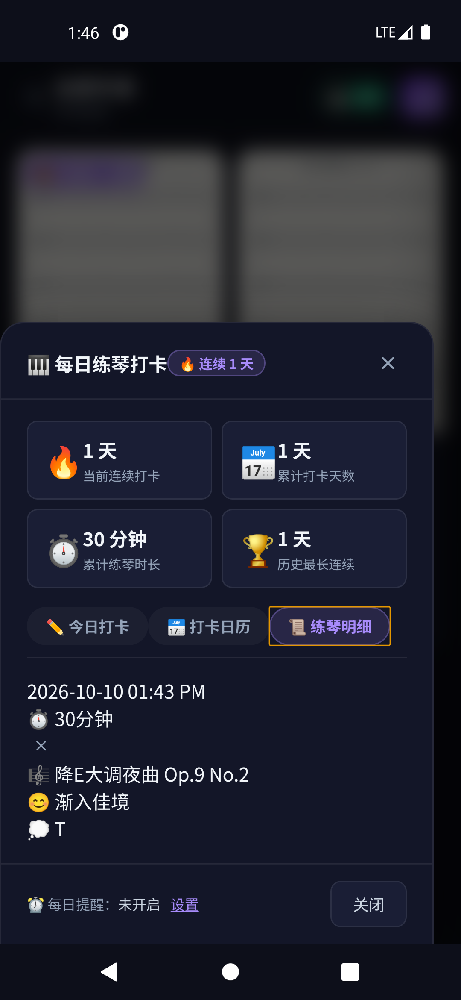
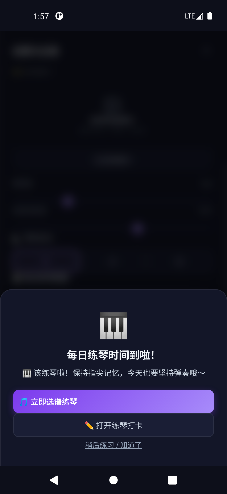
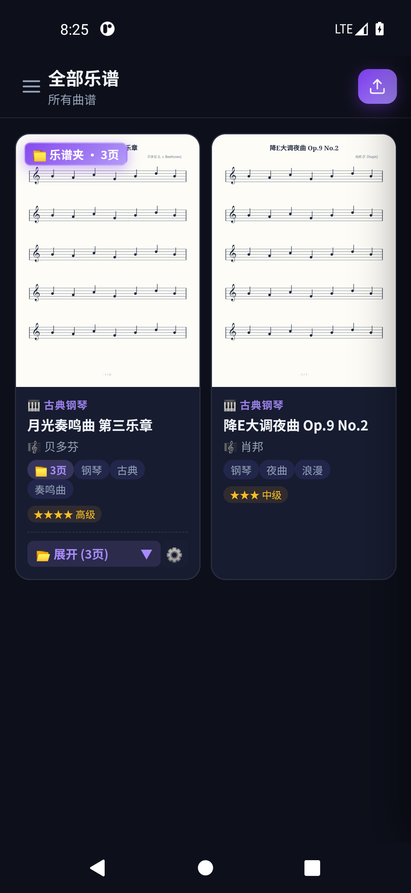
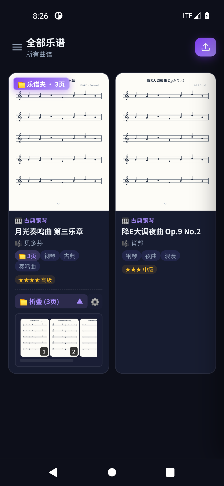
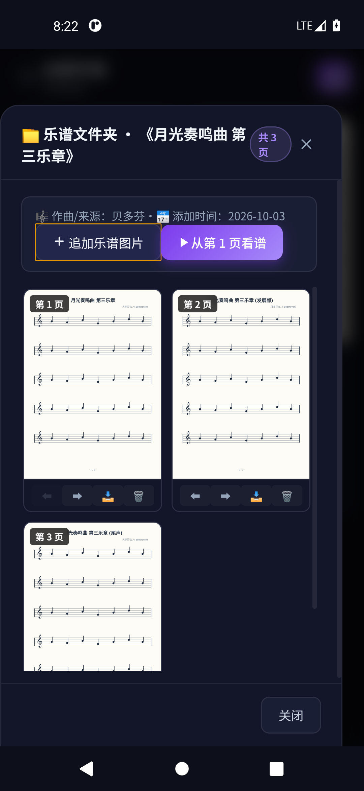
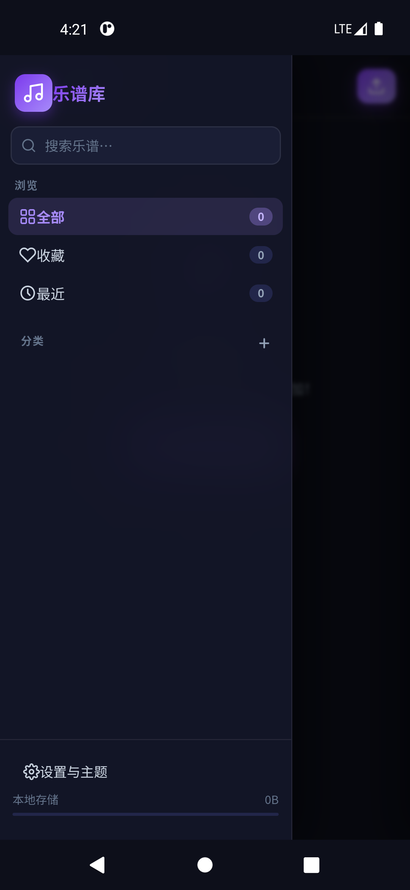
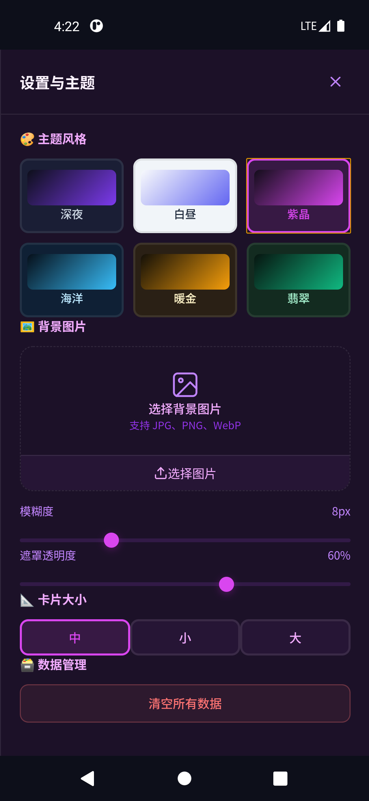

# 🎵 乐谱库 (Music Score App)

> 一款专为音乐爱好者、演奏家与琴童设计的**跨平台纯本地乐谱管理与演奏助手**。支持 PWA 离线安装与 Android 原生 APK 安装，拥有现代高质感毛玻璃 UI、多套预设主题、自定义背景壁纸、多张乐谱折叠乐谱夹、页面排序管理、乐谱缩放平移、手写标注以及沉浸式舞台演奏模式。


---

## ✨ 核心特性

### 📅 每日练琴打卡与智能提醒系统（最新特性）
- **每日练琴打卡**：记录每日练习曲目、练习时长（15/30/45/60/90分钟或自定义）、练习心得与练习心情（🎉 突破、💪 充实、⚖️ 平稳、🤯 烧脑、😴 略累）。
- **连续打卡与统计看板**：自动统计累计打卡天数、连续打卡天数、总练习时长与打卡完成率，顶部导航栏与侧边栏实时点亮连续打卡天数徽章。
- **全景打卡日历**：按月份直观查看打卡足迹，打卡日高亮标记总时长与乐符图标，点击任意打卡日即时展开当日练习明细。
- **练习历史明细时间轴**：完整记录过往每次练习的乐谱曲目、练习时长、心情气泡与心得笔记，支持单条记录管理与删除。
- **每日定时提醒练琴**：支持自定义每日提醒时间与提醒激励文案；到达设定时间触发琴弦和弦音效（Web Audio API 真实物理合成），弹出练琴提醒弹窗，一键直达乐谱库或选谱练琴；支持系统原生通知推送。
- **看谱页一键快捷打卡**：在全屏乐谱演奏或阅读时，顶部一键点击 **打卡** 按钮，自动预填当前演奏曲目，练完即打卡。

### 📁 多图折叠乐谱夹与页面管理
- **多页自动聚合折叠**：一首曲目可添加任意多张乐谱图片。多页曲目在列表中自动折叠收纳为**“乐谱夹”**，具备精美双层物理纸张层叠阴影效果与 `📁 乐谱夹 · N页` 徽章。
- **列表内即时展开各页预览**：点击卡片底部的 `📁 展开 (N页) ▼` 栏，即可就地下滑展开水平滑动条，浏览所有页面的迷你缩略图，点击任意页直接跳页演奏，末尾更提供 `+` 快速加图入口。
- **乐谱文件夹专属管理面板**：轻触卡片设置齿轮 ⚙️ 打开专属管理弹窗，大图网格全览所有乐谱页面。支持点击 `⬅️` / `➡️` 自由微调页码顺序（各页专属手写标注随之精准迁移同步）、单页原图导出下载（`📥`）、单页精准删除（`🗑️`）以及批量追加新乐谱。
- **新建与追加归档双模式**：上传弹窗支持“新建乐谱/乐谱夹”或“追加到已有乐谱”；多图批量导入前支持通过 `▲` / `▼` 按钮自由排序。
- **看谱全屏目录导览抽屉**：全屏看谱时点击顶部 **📑 目录** 按钮，侧边实时呼出各页缩略图导航抽屉，翻页时焦点高亮智能同步跟随。

### 🎼 专业乐谱浏览与演奏体验
- **多页乐谱支持**：连续翻页阅读、键盘左右方向键翻页、移动端轻触翻页。
- **无级缩放与拖拽平移**：移动端双指手势缩放、PC 端滚轮及双击放大，任意查看乐谱微小音符与指法细节。
- **互动手写标注**：内置自由笔刷、高亮荧光笔、橡皮擦，支持自定义颜色与粗细，练习标记随心记。
- **舞台全屏演奏模式**：一键进入舞台模式，隐藏所有杂乱干扰元素，支持屏幕常亮 (Wake Lock)，支持大触控区快速翻页。

### 🎨 现代高质感视觉与个性化
- **6 套预设精美主题**：
  - 🌙 **深夜 (Night)**：低调护眼的极暗黑夜风格
  - ☀️ **白昼 (Day)**：清晰素雅的纯净明朗风格
  - 🔮 **紫晶 (Amethyst)**：优雅神秘的紫晶渐变风格
  - 🌊 **海洋 (Ocean)**：静谧深邃的湛蓝海水风格
  - 🍂 **暖金 (Warm Gold)**：温暖醇厚的复古香槟风格
  - 🍃 **翡翠 (Emerald)**：生机盎然的清透翠绿风格
- **自定义背景壁纸**：支持上传任意自定义图片作为背景，并支持调节**背景高斯模糊 (Blur)** 与 **暗色遮罩透明度 (Overlay Opacity)**。
- **卡片自适应网格**：支持在大、中、小三种卡片显示尺寸间自由切换。

### 🔍 智能分类与标签管理
- **多维度筛选**：按乐器、流派分类（古典、流行、爵士、民谣、练习曲等），支持按难度（1 ~ 5 星）与作曲家快速筛选。
- **标签系统**：支持自由添加标签，智能输入推荐，支持快速搜索乐谱名称与作者。
- **收藏与最近查看**：一键星标收藏常用曲目，自动记录最近浏览历史。

### 🔒 纯本地离线与隐私安全
- **100% 离线可用**：所有乐谱数据、标注信息、设置参数均安全保存在设备本地 **IndexedDB** 数据库中。
- **零服务端依赖**：无需登录、无云端上传、无任何广告与追踪，彻底保护演奏者的曲目资产。

---

## 📱 界面预览

| 每日打卡与练琴统计 | 打卡日历与足迹 | 练习历史明细 | 每日定时提醒练琴 |
| :---: | :---: | :---: | :---: |
|  |  |  |  |

| 乐谱夹折叠与层叠效果 | 列表内即时展开各页预览 | 乐谱文件夹管理面板 |
| :---: | :---: | :---: |
|  |  |  |

| 侧边栏与分类目录 | 主题风格与壁纸设置 |
| :---: | :---: |
|  |  |

---

## 🚀 安装与使用方式

### 方式一：直接安装 Android 原生 APK（推荐）
项目已完成原生打包签名，体积仅约 **66 KB**，超轻量无臃肿依赖：
1. 从本仓库直接下载 [MusicScore.apk](./MusicScore.apk)
2. 在 Android 手机或平板设备上点击安装即可使用（支持 Android 5.0+ / API 21+ 系统）

### 方式二：PWA 网页一键安装（桌面 / iOS / Android 通用）
1. 使用浏览器（如 Chrome、Edge、Safari）访问在线页面
2. 点击浏览器地址栏的 **“安装应用”** 图标或底部弹出的 **“添加到主屏幕”**
3. 安装后将以独立原生应用窗口启动，具备完整离线缓存支持

### 方式三：本地运行
如果你希望在本地开发或私有局域网中运行：
```bash
# 进入项目目录
cd music-score-app

# 使用任意本地静态服务器启动（例如 Python）
python -m http.server 8765

# 在浏览器中访问
http://localhost:8765
```

---

## 🛠️ 项目结构

```
music-score-app/
├── MusicScore.apk            # 已打包签名的 Android 原生应用 (约 66KB)
├── index.html                # 应用主页面结构与乐谱文件夹管理组件
├── style.css                 # 现代毛玻璃 UI、乐谱夹层叠纸张效果与主题样式
├── app.js                    # 业务逻辑、乐谱夹折叠/展开、排序管理与离线存储
├── manifest.json             # PWA 配置文件
├── sw.js                     # Service Worker 离线缓存引擎
├── icons/                    # 高清应用图标 (192x192, 512x512)
├── docs/screenshots/         # 应用高清截图预览 (包含最新乐谱夹视图)
└── android/                  # Android 原生封装项目源码
    ├── AndroidManifest.xml   # Android 清单文件与系统权限配置
    ├── src/                  # 原生 Java 容器 (支持全屏、WebView、文件选择器)
    └── res/                  # 原生 Android 资源文件 (mipmap 图标、样式等)
```

---

## 💡 技术栈说明

- **前端架构**：原生 HTML5 + CSS3 (CSS Variables, Flexbox, CSS Grid) + Vanilla JavaScript (ES6+)
- **本地存储**：IndexedDB API（无体积上限的大容量二进制乐谱与标注存储）
- **离线支持**：Service Worker API 缓存静态资源
- **移动原生层**：Android Native SDK 原生包装，适配 `WebChromeClient` 多图选择回调与沉浸式状态栏

---

## 📄 开源许可证

本项目基于 [MIT License](LICENSE) 开源。欢迎 Star ⭐️、Fork 与提交 Issue！
